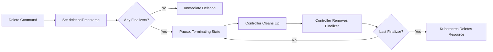

# Finalizers in Kubernetes: Complete Guide

## **What are Finalizers?**

Finalizers are **keys** in Kubernetes metadata that prevent resources from being deleted until specific conditions are met. They act as "delete gatekeepers" that ensure cleanup operations complete before resource deletion.

## **Why Use Finalizers? Key Use Cases**

### 1. **Prevent Accidental Deletion**
Prevents users from deleting resources that other components depend on.

### 2. **Graceful Cleanup**
Ensures proper cleanup of external resources (cloud resources, databases, etc.) before deleting Kubernetes resources.

### 3. **Controller Safety**
Prevents race conditions when multiple controllers manage the same resource.

### 4. **Resource Dependency Management**
Ensures dependent resources are cleaned up in the correct order.

## **How Finalizers Work**

```yaml
apiVersion: v1
kind: ConfigMap
metadata:
  name: example-config
  finalizers:
  - custom-controller.example.com/cleanup
  - kubernetes
```

When you delete a resource:
1. Resource is marked for deletion (`deletionTimestamp` is set)
2. Resource enters **termination** phase (not deleted yet)
3. Controllers watching for the finalizer perform cleanup
4. Each controller removes its finalizer when done
5. When ALL finalizers are removed, resource is finally deleted

---

## **Practical Examples**

### **Example 1: Preventing Accidental PV/PVC Deletion**

```yaml
apiVersion: v1
kind: PersistentVolume
metadata:
  name: important-data-pv
  finalizers:
  - kubernetes.io/pv-protection
spec:
  capacity:
    storage: 10Gi
  accessModes:
    - ReadWriteOnce
  hostPath:
    path: /data/important
```

**Try to delete:**
```bash
$ kubectl delete pv important-data-pv
Error: persistentvolumes "important-data-pv" is forbidden: 
cannot delete protected volume with finalizers [kubernetes.io/pv-protection]
```

### **Example 2: Custom Resource Cleanup**

```yaml
apiVersion: example.com/v1
kind: Database
metadata:
  name: prod-db
  finalizers:
  - database.example.com/cloud-cleanup
spec:
  instanceType: db.t3.medium
  storageGB: 100
```

Your controller would:
1. Watch for Database resources with deletion timestamp
2. Delete the actual cloud database
3. Remove the finalizer
4. Allow Kubernetes to delete the custom resource

---

## **Full Demo: AWS S3 Bucket Finalizer**

### **1. Create a Custom Resource Definition**

```yaml
# s3bucket-crd.yaml
apiVersion: apiextensions.k8s.io/v1
kind: CustomResourceDefinition
metadata:
  name: s3buckets.storage.example.com
spec:
  group: storage.example.com
  versions:
    - name: v1
      served: true
      storage: true
      schema:
        openAPIV3Schema:
          type: object
          properties:
            spec:
              type: object
              properties:
                bucketName:
                  type: string
                region:
                  type: string
  scope: Namespaced
  names:
    plural: s3buckets
    singular: s3bucket
    kind: S3Bucket
    shortNames:
    - s3b
```

```bash
kubectl apply -f s3bucket-crd.yaml
```

### **2. Create a Controller (Python Example)**

```python
# s3-controller.py
from kubernetes import client, config, watch
import boto3
import time

config.load_kube_config()
v1 = client.CoreV1Api()
crd_api = client.CustomObjectsApi()

GROUP = "storage.example.com"
VERSION = "v1"
PLURAL = "s3buckets"
FINALIZER = "s3.cleanup.example.com"

def create_s3_bucket(bucket_name, region):
    """Create actual S3 bucket"""
    s3 = boto3.client('s3', region_name=region)
    try:
        s3.create_bucket(
            Bucket=bucket_name,
            CreateBucketConfiguration={'LocationConstraint': region}
        )
        print(f"Created S3 bucket: {bucket_name}")
    except Exception as e:
        print(f"Error creating bucket: {e}")

def delete_s3_bucket(bucket_name, region):
    """Delete S3 bucket and all objects"""
    s3 = boto3.client('s3', region_name=region)
    
    # Delete all objects first
    objects = s3.list_objects_v2(Bucket=bucket_name)
    if 'Contents' in objects:
        for obj in objects['Contents']:
            s3.delete_object(Bucket=bucket_name, Key=obj['Key'])
    
    # Delete bucket
    s3.delete_bucket(Bucket=bucket_name)
    print(f"Deleted S3 bucket: {bucket_name}")

def watch_s3buckets():
    """Watch for S3Bucket CRD events"""
    resource_version = ""
    
    while True:
        stream = watch.Watch().stream(
            crd_api.list_cluster_custom_object,
            GROUP, VERSION, PLURAL,
            resource_version=resource_version
        )
        
        for event in stream:
            obj = event['object']
            metadata = obj.get('metadata', {})
            name = metadata.get('name')
            namespace = metadata.get('namespace')
            spec = obj.get('spec', {})
            
            print(f"Event: {event['type']} - {name}")
            
            # Handle ADDED events
            if event['type'] == 'ADDED':
                # Add finalizer if not present
                finalizers = metadata.get('finalizers', [])
                if FINALIZER not in finalizers:
                    finalizers.append(FINALIZER)
                    patch = [{"op": "add", "path": "/metadata/finalizers", "value": finalizers}]
                    crd_api.patch_namespaced_custom_object(
                        GROUP, VERSION, namespace, PLURAL, name, patch
                    )
                
                # Create actual S3 bucket
                create_s3_bucket(spec['bucketName'], spec.get('region', 'us-east-1'))
            
            # Handle DELETED events
            elif event['type'] == 'DELETED':
                # Check if deletion is requested
                if metadata.get('deletionTimestamp'):
                    # Cleanup S3 bucket
                    delete_s3_bucket(spec['bucketName'], spec.get('region', 'us-east-1'))
                    
                    # Remove finalizer
                    finalizers = metadata.get('finalizers', [])
                    if FINALIZER in finalizers:
                        finalizers.remove(FINALIZER)
                        patch = [{"op": "replace", "path": "/metadata/finalizers", "value": finalizers}]
                        crd_api.patch_namespaced_custom_object(
                            GROUP, VERSION, namespace, PLURAL, name, patch
                        )
            
            resource_version = metadata.get('resourceVersion', resource_version)
        
        time.sleep(1)

if __name__ == "__main__":
    watch_s3buckets()
```

### **3. Create an S3Bucket Resource**

```yaml
# s3-bucket.yaml
apiVersion: storage.example.com/v1
kind: S3Bucket
metadata:
  name: my-app-bucket
  namespace: default
spec:
  bucketName: "my-app-data-2024"
  region: "us-east-1"
```

```bash
kubectl apply -f s3-bucket.yaml
```

### **4. Test the Finalizer**

```bash
# Try to delete the resource
kubectl delete s3bucket my-app-bucket

# Check status (will show deletionTimestamp)
kubectl get s3bucket my-app-bucket -o yaml

# You'll see:
# metadata:
#   deletionTimestamp: "2024-01-15T10:00:00Z"
#   finalizers:
#   - s3.cleanup.example.com

# Controller will delete actual S3 bucket, then remove finalizer
# Resource will be deleted automatically after finalizer removal
```

### **5. Manual Finalizer Removal (Emergency)**

```bash
# Force remove finalizer (DANGEROUS - orphaned resources!)
kubectl patch s3bucket my-app-bucket \
  --type json \
  --patch='[{"op": "remove", "path": "/metadata/finalizers"}]'
```

---
## **Chronology of Finalizer Deletion - Complete Explanation**

Let me clarify with a **step-by-step chronological example**:

## **The Golden Rule:**
**Resources with finalizers will NOT be deleted until ALL finalizers are removed.**  
The deletion process pauses at the "Terminating" state until finalizers are cleared.

## **Complete Chronology with Example**

### **Scenario:** Deleting a PersistentVolume with PVC Protection

```yaml
# Create a PV with protection
apiVersion: v1
kind: PersistentVolume
metadata:
  name: my-pv
  finalizers:
  - kubernetes.io/pv-protection
spec:
  capacity:
    storage: 1Gi
  accessModes:
    - ReadWriteOnce
  hostPath:
    path: /mnt/data
```

---

## **Chronological Timeline:**

### **Phase 1: Deletion Request**
```bash
# User requests deletion
$ kubectl delete pv my-pv

# IMMEDIATE RESULT:
$ kubectl get pv my-pv
NAME    CAPACITY   STATUS        AGE
my-pv   1Gi        Terminating   5m
```

**What happens internally:**
1. Kubernetes sets `deletionTimestamp` on the resource
2. **Resource enters "Terminating" state**
3. **Deletion process PAUSES here**
4. Resource is NOT deleted yet

**Check the YAML:**
```bash
$ kubectl get pv my-pv -o yaml
apiVersion: v1
kind: PersistentVolume
metadata:
  deletionTimestamp: "2024-01-15T10:00:00Z"  # <-- Set immediately
  finalizers:
  - kubernetes.io/pv-protection               # <-- Still present!
  name: my-pv
spec:
  # ... spec remains
status:
  phase: Terminating                          # <-- New status
```

---

### **Phase 2: Controller Intervention**

**WHO removes finalizers? Two possibilities:**

#### **Option A: Automatic Removal (Typical Case)**
A **controller/operator** watching for resources with `deletionTimestamp`:

1. Controller detects PV has `deletionTimestamp`
2. Controller checks: "Is there any PVC bound to this PV?"
3. If NO PVC is bound → Controller removes the finalizer
4. If PVC IS bound → Controller does NOT remove finalizer (blocks deletion)

**Controller logic pseudocode:**
```python
if resource.deletionTimestamp and "kubernetes.io/pv-protection" in finalizers:
    if not pvc_bound_to_pv(resource):  # Check dependency
        remove_finalizer(resource, "kubernetes.io/pv-protection")
```

#### **Option B: Manual Removal (Emergency/Force)**
```bash
# Force remove finalizer (BYPASSES controller)
$ kubectl patch pv my-pv --type json \
  --patch='[{"op": "remove", "path": "/metadata/finalizers"}]'

# Immediately after:
$ kubectl get pv my-pv
Error from server (NotFound): persistentvolumes "my-pv" not found
# DELETED!
```

---

### **Phase 3: Final Deletion**

**What triggers actual deletion?**


**Key Insight:** Kubernetes itself doesn't remove finalizers. **Controllers do**.  
Kubernetes just waits for finalizers to disappear, then proceeds with deletion.

---

## **Detailed Example with Custom Controller**

### **1. Create a Protected ConfigMap**
```yaml
# protected-cm.yaml
apiVersion: v1
kind: ConfigMap
metadata:
  name: protected-data
  annotations:
    cleanup-wait-seconds: "10"  # Controller will wait 10s
  finalizers:
  - custom-cleanup.example.com/wait
data:
  key: "important-value"
```

```bash
kubectl apply -f protected-cm.yaml
```

### **2. Simple Controller that Automatically Removes Finalizer**
```python
# cleanup-controller.py
from kubernetes import client, config, watch
import time

config.load_kube_config()
v1 = client.CoreV1Api()
FINALIZER = "custom-cleanup.example.com/wait"

def watch_configmaps():
    w = watch.Watch()
    
    for event in w.stream(v1.list_config_map_for_all_namespaces):
        cm = event['object']
        name = cm.metadata.name
        namespace = cm.metadata.namespace
        
        # Check if it's our protected configmap
        if name == "protected-data":
            print(f"Event: {event['type']} - {name}")
            
            # If deletion requested
            if cm.metadata.deletion_timestamp:
                print(f"ConfigMap {name} is terminating!")
                print(f"Finalizers: {cm.metadata.finalizers}")
                
                # Check if our finalizer exists
                if FINALIZER in (cm.metadata.finalizers or []):
                    # SIMULATE CLEANUP WORK
                    wait_seconds = int(cm.metadata.annotations.get(
                        'cleanup-wait-seconds', '5'
                    ))
                    print(f"Waiting {wait_seconds} seconds for cleanup...")
                    time.sleep(wait_seconds)
                    
                    # REMOVE FINALIZER (triggers actual deletion)
                    print("Cleanup complete! Removing finalizer...")
                    
                    # Get current CM
                    current_cm = v1.read_namespaced_config_map(name, namespace)
                    current_finalizers = current_cm.metadata.finalizers or []
                    
                    if FINALIZER in current_finalizers:
                        current_finalizers.remove(FINALIZER)
                        
                        # Patch to remove finalizer
                        patch = {
                            "metadata": {
                                "finalizers": current_finalizers
                            }
                        }
                        v1.patch_namespaced_config_map(
                            name, namespace, patch
                        )
                        print(f"Finalizer removed from {name}")
                        print("Kubernetes will now delete the ConfigMap automatically")

if __name__ == "__main__":
    watch_configmaps()
```

### **3. Run the Demo**
```bash
# Terminal 1: Run controller
python3 cleanup-controller.py

# Terminal 2: Apply and delete ConfigMap
kubectl apply -f protected-cm.yaml
kubectl delete cm protected-data

# Watch what happens
kubectl get cm protected-data -w
```

### **Expected Output:**
```
# Terminal 2:
$ kubectl delete cm protected-data
configmap "protected-data" deleted

$ kubectl get cm protected-data -w
NAME             DATA   AGE
protected-data   1      5s
protected-data   1      7s   # Still exists
protected-data   1      10s  # Still exists (waiting for controller)
protected-data   1      12s  # Still exists
protected-data   0      15s  # FINALLY DELETED!

# Terminal 1 (Controller logs):
Event: ADDED - protected-data
Event: MODIFIED - protected-data
ConfigMap protected-data is terminating!
Finalizers: ['custom-cleanup.example.com/wait']
Waiting 10 seconds for cleanup...
Cleanup complete! Removing finalizer...
Finalizer removed from protected-data
Kubernetes will now delete the ConfigMap automatically
```

---

## **What If Controller Crashes?**

### **Stuck Resource Scenario:**
1. User deletes resource with finalizer
2. Controller responsible for cleanup **crashes**
3. Finalizer is NEVER removed
4. Resource stays in "Terminating" state **FOREVER**

```bash
# Check for stuck resources
$ kubectl get all --all-namespaces | grep Terminating
default     pod/stuck-pod    0/1     Terminating   15h

# Investigate why
$ kubectl describe pod stuck-pod
Events:
  Warning   FailedFinalizerCleanup  15h ago
            Controller crashed, finalizer not removed
```

### **Recovery Options:**
```bash
# 1. Restart the controller (let it cleanup)
# 2. Manually cleanup external dependencies
# 3. Force remove finalizer (LAST RESORT!)

kubectl patch pod stuck-pod --type json \
  --patch='[{"op": "remove", "path": "/metadata/finalizers"}]'
```

---

## **Automatic vs Manual: Summary Table**

| Aspect | Automatic Removal | Manual Removal |
|--------|------------------|----------------|
| **Who does it** | Controller/Operator | Human Admin |
| **When** | After cleanup completes | Emergency situations |
| **Safety** | Safe (cleanup done) | Risky (may orphan resources) |
| **Example** | PV controller checks PVC binding | `kubectl patch --remove-finalizers` |
| **Result** | Proper cleanup → Delete | Bypass cleanup → Delete |

---

## **The Complete Chronology in Simple Terms:**

1. **You:** `kubectl delete resource`
2. **Kubernetes:** "OK, I'll mark it for deletion" (sets `deletionTimestamp`)
3. **Kubernetes:** "Hmm, there are finalizers. I'll wait."
4. **Kubernetes:** Changes status to "Terminating" and **PAUSES**
5. **Controllers:** "I see a resource needs cleanup!" (detects `deletionTimestamp`)
6. **Controllers:** Perform cleanup tasks (delete cloud resources, backups, etc.)
7. **Controllers:** "Cleanup done!" → Remove their finalizer
8. **Kubernetes:** "All finalizers gone? Great! *Now* I'll delete it."
9. **Resource:** **Actually deleted from etcd**

## **Key Takeaway:**
**Finalizers are NOT automatically removed by Kubernetes.**  
They're removed by **controllers** that implement business logic.  
If no controller removes them, the resource stays "Terminating" forever.

This is why you need:
- **Reliable controllers** that don't crash
- **Monitoring** for stuck terminating resources
- **Emergency procedures** for manual cleanup


## **Common Built-in Finalizers**

| Finalizer | Purpose |
|-----------|---------|
| `kubernetes.io/pv-protection` | Prevents PV deletion while bound to PVC |
| `kubernetes.io/pvc-protection` | Prevents PVC deletion while bound to pod |
| `foregroundDeletion` | Child resources deleted before parent |
| `orphan` | Controls cascade deletion |
| `custom-controller/finalizer` | Custom controller cleanup |

---

## **LinkedIn Post**

**Post Title:** Kubernetes Finalizers: The Unsung Heroes of Resource Cleanup 🛡️

**Post Content:**

Ever accidentally deleted a Kubernetes resource only to realize it had dependencies? Or struggled with cleaning up external resources properly? Enter **Kubernetes Finalizers** - your safety net for controlled resource deletion! 🔐

🎯 **What are Finalizers?**
They're metadata keys that act as "delete gatekeepers," preventing resource deletion until specific cleanup operations complete. Think of them as a checklist that must be fully checked off before Kubernetes allows deletion.

🚨 **Why They Matter:**
1️⃣ **Prevent Data Loss** - Protect PVs/PVCs from accidental deletion
2️⃣ **Cleanup External Resources** - Ensure cloud resources (S3, DBs, VMs) are properly cleaned up
3️⃣ **Avoid Orphaned Resources** - Prevent cloud bill surprises from forgotten resources
4️⃣ **Orderly Deletion** - Manage dependencies between resources

💡 **Real-World Example:**
When deleting a custom "S3Bucket" resource, a finalizer ensures:
1. Actual AWS S3 bucket is emptied
2. Bucket is deleted from AWS
3. Only THEN is the Kubernetes resource removed
4. No orphaned S3 buckets left behind!

⚠️ **Pro Tip:** Finalizers can block deletion indefinitely if controllers crash! Always monitor resources stuck in "Terminating" state.

🔧 **Got Stuck Resources?** Use:
```bash
kubectl patch <resource> <name> --type json \
  --patch='[{"op": "remove", "path": "/metadata/finalizers"}]'
```
(Use cautiously - can orphan external resources!)

📚 **Deep Dive:** Check out my complete demo showing how to implement custom finalizers with Python controllers for AWS resource management.

#Kubernetes #DevOps #CloudNative #SRE #ContainerOrchestration #CloudComputing #InfrastructureAsCode #PlatformEngineering

**Hashtags:**
#Kubernetes #DevOps #CloudNative #SRE #ContainerOrchestration #CloudComputing #InfrastructureAsCode #PlatformEngineering #Finalizers #ResourceManagement

---

## **Best Practices**

1. **Always have timeout logic** in your controller to prevent indefinite blocking
2. **Monitor terminating resources** with alerts
3. **Document finalizers** used in your cluster
4. **Test cleanup paths** thoroughly
5. **Use informative finalizer names** (e.g., `company.com/resource-type-cleanup`)

## **Troubleshooting**

```bash
# List resources stuck in terminating state
kubectl get all --all-namespaces | grep Terminating

# See finalizers on a resource
kubectl get <resource> <name> -o jsonpath='{.metadata.finalizers}'

# Check deletion timestamp
kubectl get <resource> <name> -o jsonpath='{.metadata.deletionTimestamp}'
```

Finalizers are powerful but require careful implementation. They're essential for production-grade Kubernetes operators and ensuring clean resource lifecycle management!